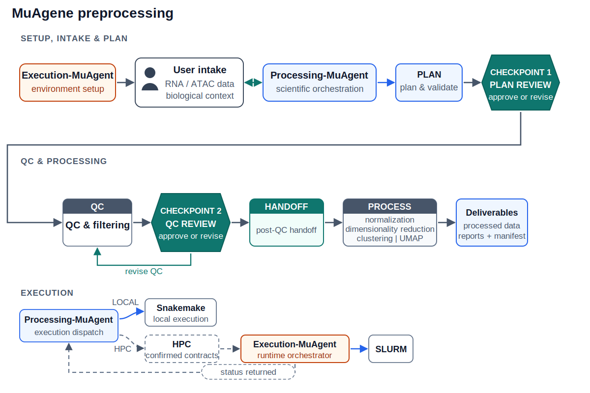

# MuAgene

MuAgene is an agent-first framework for reproducible single-cell RNA and ATAC
preprocessing. It separates scientific decision-making from platform execution while
presenting one conversational interface to the user.

MuAgene supports RNA-only, ATAC-only, paired multiome, and unpaired RNA-plus-ATAC
workflows. It produces quality-controlled, per-modality representations through
clustering and UMAP. Integration, cell-type annotation, marker discovery, and
gene-regulatory network inference are outside its scope.



## Processing and Execution boundaries

| Component | Responsibility | User interaction |
|---|---|---|
| [Processing-MuAgent](Processing-MuAgent/README.md) | Scientific intent, input validation, preprocessing strategy, parameter provenance, review checkpoints, and deliverables | The user-facing agent |
| [Execution-MuAgent](Execution-MuAgent/README.md) | Machine setup, environment provisioning, SLURM submission, supervision, and structured execution findings | Operator-facing during setup; no direct user interaction during a run |

For local runs, Processing-MuAgent executes the scientific workflow directly. For
SLURM runs, it prepares the confirmed job specification and delegates provisioning,
submission, and monitoring to Execution-MuAgent. Execution-MuAgent never changes the
scientific plan or chooses recovery actions; Processing-MuAgent explains findings and
asks the user how to proceed.

The machine-readable boundary is declared in
[`muagene.agents.yaml`](muagene.agents.yaml), with shared state and handoff contracts
under [`contracts/`](contracts/).

## What to expect

The normal user journey is:

```text
intake and context
  → preprocessing plan and QC preview
  → plan review
  → modality-aware QC and doublet filtering
  → QC review
  → verified post-QC handoff
  → user confirms the unattended finish batch
  → normalization, embeddings, clustering, UMAP, and final manifest
```

The agent stops for decisions rather than silently changing inputs, workflow type,
scientific parameters, or execution settings. Detailed preprocessing stages, supported
formats, QC defaults, and outputs are documented in the
[Processing-MuAgent guide](Processing-MuAgent/README.md).

## Getting started

### 1. Set up MuAgene

From the MuAgene repository, bootstrap the integrated `muagene` environment:

```bash
bash Execution-MuAgent/scripts/bootstrap.sh \
  --processing-repo Processing-MuAgent
conda activate muagene
```

CPU setup is the default. See the
[Execution-MuAgent installation guide](Execution-MuAgent/README.md#installation) for
 details.

### 2. Start a preprocessing run

Attach the root [`AGENT.md`](AGENT.md) to your agent chat interface (or ask an
agent with repository access to read it), then provide the required inputs:

```text
Act as MuAgene. Follow the root AGENT.md loading order and load only the
Processing skill selected by observable run state.

Task: Preprocess <RNA-only | ATAC-only | paired | unpaired> single-cell data.
Run directory: <path>
Inputs: <input path(s)>

Biological context:
- genome assembly: <assembly>
- organism: <organism>
- tissue or cell line: <context>
- assay: <assay>
- marker genes for the ambient-RNA check: <genes | defer | skip>

Execution mode: <local | SLURM>
Environment: muagene

Stop at each review checkpoint and wait for my explicit approval. After the
post-QC handoff, ask before proceeding to downstream stages.
```

The agent collects any missing information, confirms the workflow and execution mode,
and presents each required decision before launching compute.

### 3. Interact through Processing-MuAgent

Continue using Processing-MuAgent for plan review, QC review, status, failure
explanations, recovery, and final outputs. Execution-MuAgent runtime commands are
invoked internally; users interact with them directly only for machine setup and
environment maintenance.

## Documentation

- [`AGENT.md`](AGENT.md): single agent-instruction entry point, loading order, component
  boundary, canonical terminology, and source-of-truth precedence.
- [Processing-MuAgent](Processing-MuAgent/README.md): scientific inputs, preprocessing
  strategy, checkpoints, QC policies, and outputs.
- [Execution-MuAgent](Execution-MuAgent/README.md): machine requirements, installation,
  operator commands, and cluster behavior.
- [`contracts/`](contracts/): shared state ownership, schemas, and finding codes.
- [`muagene.agents.yaml`](muagene.agents.yaml): agent registry and inter-agent boundary.
- Each component's `AGENT.md`, `agent/system_prompt.md`, `agent/skills/index.md`, and
  selected skill: scoped policy and procedures reached from the root entry point.

## Guarantees

- Raw inputs are referenced in place and never overwritten.
- Run state changes only through MuAgene's official commands and tools—never by directly editing files by hand.
- Review checkpoints require explicit user approval.
- Failures are reported explicitly; execution never silently degrades environments or
  scientific intent.
