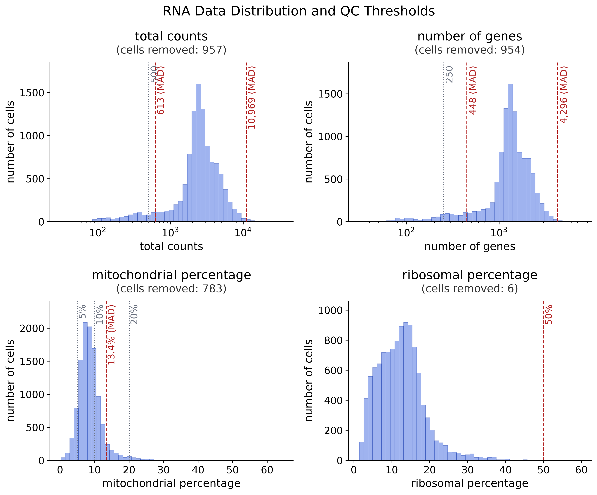
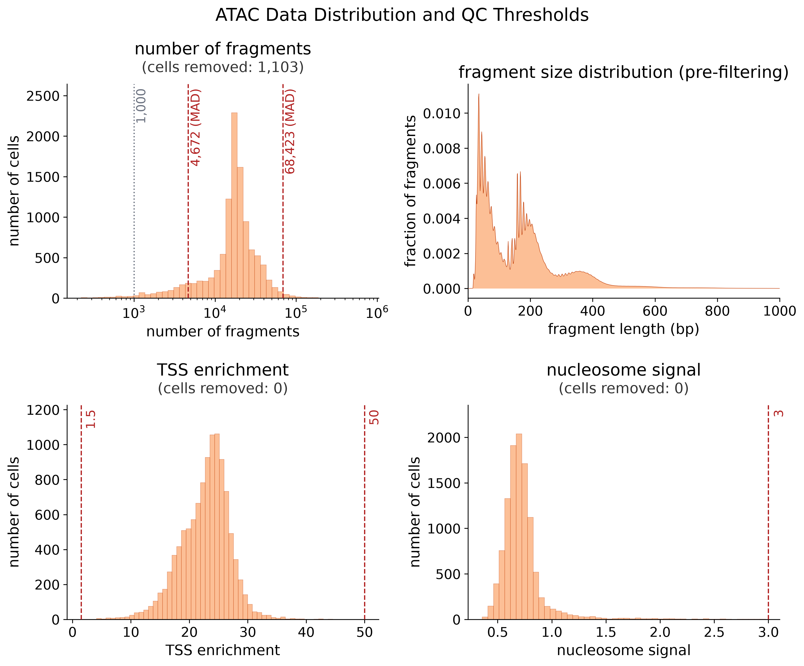

# Preprocessing plan review — pbmc10k_multiome

This run processes paired multiome data from Homo sapiens peripheral blood mononuclear cells (PBMCs) from a healthy male donor aged 30-35 (10x Genomics / AllCells; nuclei), assayed with Chromium Next GEM Single Cell Multiome ATAC + Gene Expression (v1.0, Chromium X) on genome assembly GRCh38. The pipeline will perform quality control, ambient RNA correction, doublet removal, normalization, dimensionality reduction, and clustering on jointly paired cells. The filtered RNA matrix contains 10970 cells; ATAC cell barcodes matching the RNA cell call also total 10970. A raw RNA matrix with 733612 barcodes is available for ambient estimation. Barcode pairing was established with high confidence as a single-file multiome layout in which the RNA barcodes are a complete subset of the ATAC fragment barcodes (subset coverage 1.0), so the paired workflow proceeds on shared cell identities.

## Summary

- **Execution mode** [✓ certain]
  - value: `slurm`
  - reason: In HPC mode, S0 ingest is always submitted as a supervised cluster head-job via Execution-MuAgent (its QC exploration is memory-heavy and must not run on the login node). In local mode it runs on this machine.
- **HPC configuration** [✓ certain]
  - value: `partition=cpu, account=vaquerizas, scale=4, conda=muagene`
  - reason: Cluster scheduler settings for this run. Recorded and ready for submit/resume.
- **Detected dataset type** [✓ certain]
  - value: `paired`
  - reason: RNA and ATAC from the same Cell Ranger ARC output; barcodes linked via the combined matrix file.
- **Organism** [✓ certain]
  - value: `Homo sapiens`
  - reason: User-declared in biological context.
- **Genome reference** [✓ certain]
  - value: `GRCh38`
  - reason: User-declared.
- **Pairing (RNA ↔ ATAC)** [✓ certain]
  - value: `paired (overlap=1.59%)`
  - reason: RNA and ATAC from the same Cell Ranger ARC output; barcodes linked via the combined matrix file.
- **Ambient RNA correction (S1a)** [? needs confirmation]
  - value: `On — SoupX (filtered + raw RNA → auto)`
  - reason: Available RNA inputs only pick the method: filtered alone uses DecontX; filtered plus raw uses SoupX. Whether to run ambient RNA correction depends on background noise and contamination — approve as-is if background RNA is a concern, or skip at plan review if contamination looks low after inspecting the data.
- **Marker gene expression check** [? needs confirmation]
  - value: `CD3D, CD14, MS4A1, NKG7, PPBP, FCGR3A, IL7R, LYZ, GNLY, CST3`
  - reason: Would you like to visualise how 5–10 marker genes distribute across cell clusters before and after Ambient RNA Correction? If a marker gene appears at low levels ubiquitously across cells that shouldn't express it, this is a sign of ambient RNA contamination. After correction, expression should be clearer and more restricted to the expected populations. If yes, provide gene symbols (e.g. CD3E, CD20, EPCAM). If no, leave as not set — the check is skipped.
- **QC strategy** [? needs confirmation]
  - value: `RNA: MAD on total_counts/n_genes, pct_mt ceiling=20.0, pct_ribo ceiling=50.0 | ATAC: TSS in (1.5, 50.0), MAD on log(n_fragments), nucleosome_signal<3.0, FRiP >= 0.2`
  - reason: Review the QC threshold histograms in the appendix. Default MAD thresholds are shown — any RNA or ATAC metric can be adjusted or skipped entirely with `revise` before approving. Confirm defaults are acceptable, or tell the agent which thresholds to change.
- **Doublet removal policy** [? needs confirmation]
  - value: `union`
  - paired-multiome policy: Each modality runs its own doublet detector. Cells flagged by **either** detector are removed (union). Detectors are prone to false negatives, so union minimises doublet contamination.
  - applied policy: `union`
  - RNA Scrublet score threshold: `0.25` (cells with score above are flagged)
  - ATAC SnapATAC2 probability threshold: `0.5` (cells with doublet_probability above are flagged)
  - reason: Paired multiome always uses union: remove if either detector flags.
- **Clustering strategy** [? needs confirmation]
  - value: `Leiden at fixed resolutions (RNA=0.7, ATAC=0.5)`
  - reason: Fixed per-modality defaults; clustering runs automatically with no resolution checkpoint.
- **Output location** [✓ certain]
  - value: `deliverables/results/processed_pbmc10k_multiome.h5mu`
  - reason: Paired multiome run; a deliverable manifest is written alongside the processed object.
- **Missing / uncertain info** [? needs confirmation]
  - value: `not provided: publication DOIs; low confidence: publication DOIs`
  - reason: Gaps or uncertainty flagged during biological context intake.

## Appendix: full parameters

**Workflow branch:** `paired`

### Execution
- **mode**: `slurm`
- **hpc_env**: `deliverables/plan/config/hpc.env`
- **slurm_partition**: `cpu`
- **slurm_account**: `vaquerizas`
- **resources_scale**: `4`
- **conda_env**: `muagene`
- **S0 policy**: In HPC mode, S0 ingest is always submitted as a supervised cluster head-job via Execution-MuAgent (its QC exploration is memory-heavy and must not run on the login node). In local mode it runs on this machine.

### s1a_ambient
- **marker_genes**: `['CD3D', 'CD14', 'MS4A1', 'NKG7', 'PPBP', 'FCGR3A', 'IL7R', 'LYZ', 'GNLY', 'CST3']`
  - Marker genes provided by user at intake for ambient-RNA check
- **max_contamination**: `0.5`
  - Cap per-cell rho/contamination at this fraction; prevents pathological over-correction on noisy cells.
- **method**: `auto`
  - Filtered and raw RNA → auto uses SoupX. Whether to run correction depends on background noise and contamination, not which files were supplied. Skip at plan review if contamination looks low after inspecting the data.

### s1_rna_qc
Default thresholds applied to the 10,970 loaded cells; each row counts every cell failing that threshold (independently).

| parameter | removed if | cells removed | note |
|---|---|---|---|
| total_counts | < 612.83 or > 10969.49 | 957 | Total UMI counts per cell (library size); low = empty/dying, high = potential doublets. |
| n_genes | < 447.97 or > 4296.19 | 954 | Genes detected per cell; low = low-quality, high = potential doublets. |
| pct_counts_mt | > 13.37 | 783 | Percent of counts from mitochondrial genes — high indicates stressed or dying cells. |
| pct_counts_ribo | > 50 | 6 | Percent of counts from ribosomal protein genes (Rps/Rpl/Mrps/Mrpl). |
| multiple_metrics | — | 942 | Cells failing two or more thresholds (counted once). |
| total_removed | — | 1490 | Cells removed by the combined filter (union of all thresholds). |

### s2_atac_qc
Default thresholds applied to the 10,969 loaded cells; each row counts every cell failing that threshold (independently).

| parameter | removed if | cells removed | note |
|---|---|---|---|
| n_fragments | < 4672.30 or > 68422.96 | 1103 | ATAC fragments per cell (library depth). |
| tss_enrichment | < 1.50 or > 50 | 0 | Fragment enrichment at transcription start sites (signal-to-noise). |
| nucleosome_signal | ≥ 3 | 0 | Mono- to nucleosome-free fragment ratio (nucleosome positioning quality). |
| frip | < 0.20 _(computed at runtime)_ | — | Fraction of reads in peaks — computed at runtime when a peak set is available. |
| multiple_metrics | — | 0 | Cells failing two or more thresholds (counted once). |
| total_removed | — | 1103 | Cells removed by the combined filter (union of all thresholds). |

### s3_doublets
- **atac_doublet_probability_threshold**: `0.5`
  - SnapATAC2 scrublet doublet-probability cutoff; cells with doublet_probability above this value are flagged (SnapATAC2 default is 0.5).
- **removal_policy_recommendation**: `union`
  - Paired multiome: union of RNA and ATAC doublet calls (remove if either detector flags).
- **rna_doublet_score_threshold**: `0.25`
  - RNA Scrublet doublet-score cutoff; cells with scrublet_score above this value are flagged.
- **scrublet_expected_rate**: `auto`
  - If 'auto', the rate scales as min(0.10, 0.0008 * n_cells) to track 10x's empirical doublet curve (~0.8% per 1000 cells). Override with a float to force a fixed rate.

### s4_rna_norm
- **hvg_flavor**: `seurat_v3`
  - scanpy-native; operates on raw counts layer.
- **hvg_n_top_genes**: `2000`
  - Cap; actual count min(2000, 0.1 * n_genes_after_qc).
- **target_sum**: `10000.0`
  - scanpy convention.

### s5_atac_spectral
- **drop_first**: `True`
  - Drop the first spectral component (depth-correlated); applied to obsm['X_spectral'].
- **max_top_peaks**: `50000`
  - Cap on feature selection.
- **n_components**: `50`
  - Number of spectral components from snap.tl.spectral.

### s6_neighbors
- **n_neighbors**: `15`
  - scanpy convention.
- **rna_n_pcs**: `auto`
  - If 'auto', n_pcs is chosen by elbow detection on the cumulative explained-variance curve (knee with `chord_distance`). Override with an int to force a fixed value.
- **rna_n_pcs_max**: `50`
  - Upper cap for the auto-elbow search.
- **rna_scale**: `True`
  - Apply sc.pp.scale(max_value=10) before PCA — the scanpy-standard preprocessing path. Disable to PCA the unscaled log-normalized data.

### s7_clustering
- **atac_resolution**: `0.5`
  - Fixed Leiden resolution for ATAC clustering.
- **random_state**: `0`
  - Leiden random seed.
- **rna_resolution**: `0.7`
  - Fixed Leiden resolution for RNA clustering.

### s8_umap
- **min_dist**: `0.5`
  - scanpy UMAP default.
- **random_state**: `42`
  - Run seed from config.
- **spread**: `1.0`
  - scanpy UMAP default.
