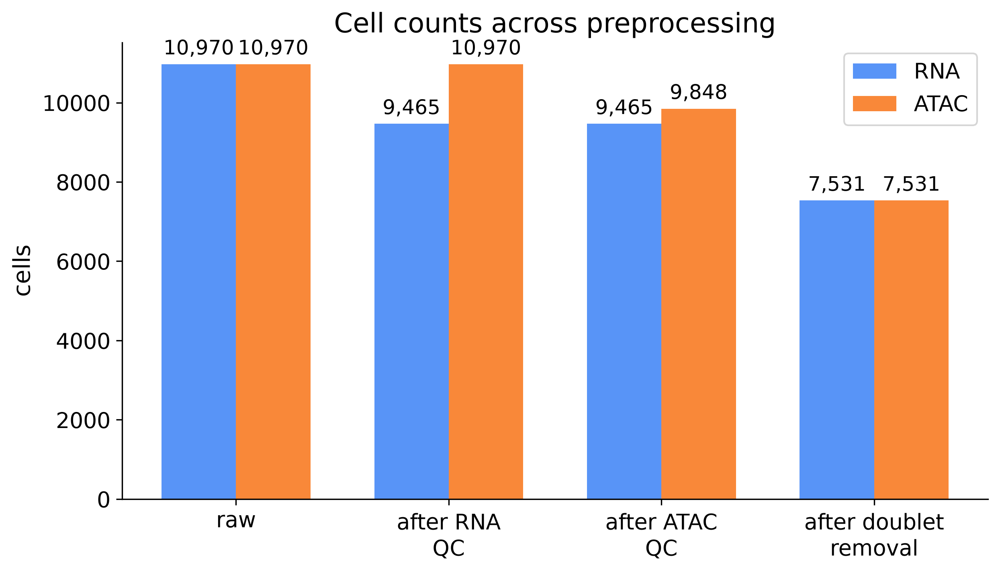
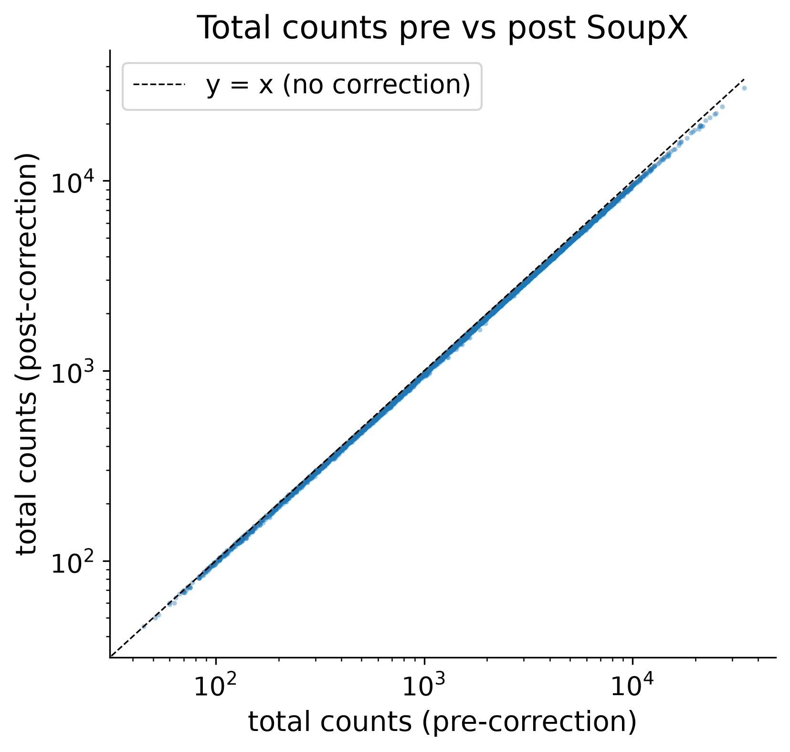
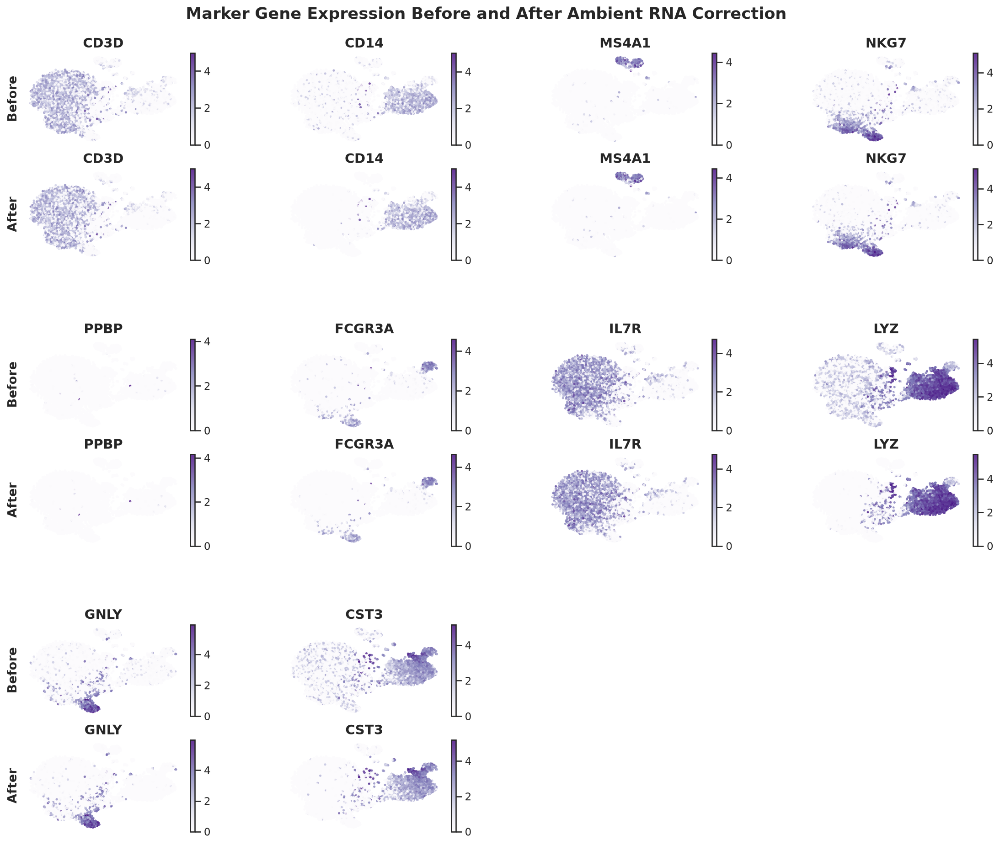
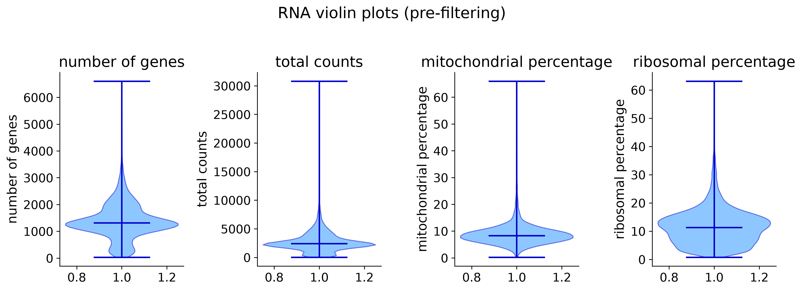
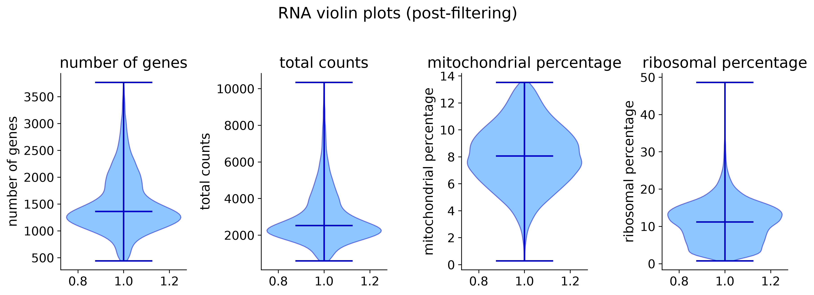
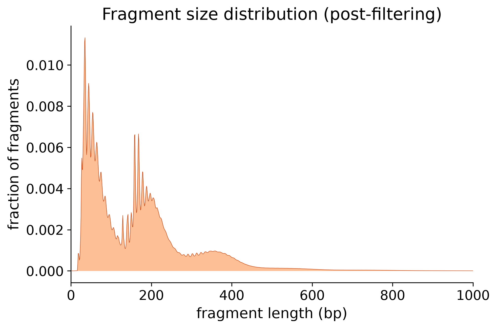
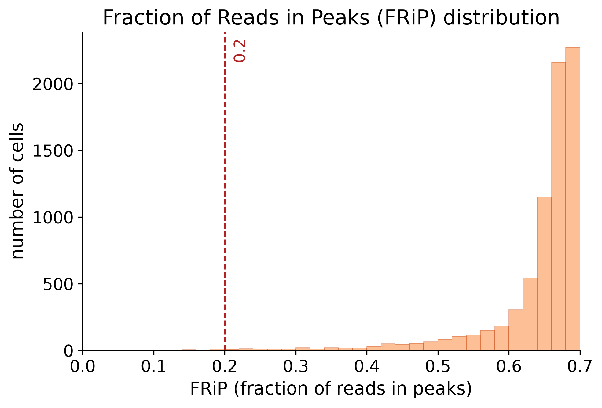
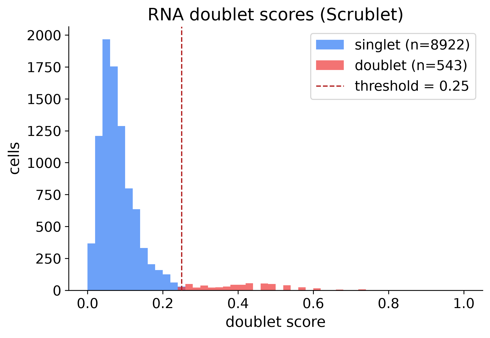
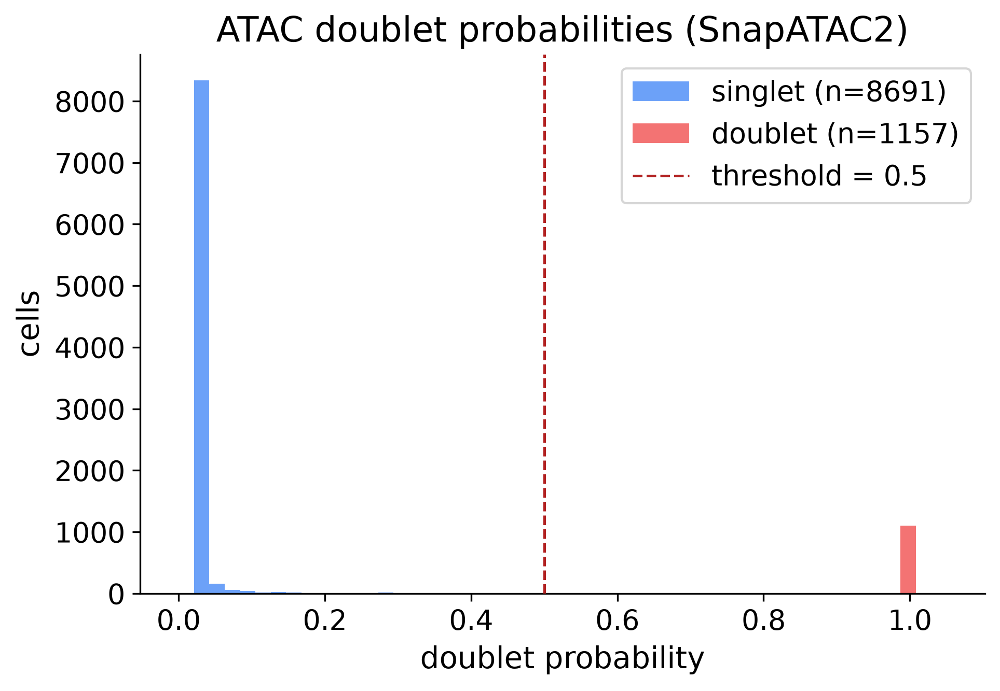

# QC review checkpoint

Review QC plots in `deliverables/figures/`. For a rendered report with images, open **qc_summary_pbmc10k_multiome.html** in this folder (generated alongside this file). Approve when satisfied, or revise thresholds and re-run affected stages before approving.

**Assay:** Chromium Next GEM Single Cell Multiome ATAC + Gene Expression (v1.0, Chromium X)
**Dataset type:** paired_multiome_candidate

## Cell-count flow across stages

| Stage | RNA | ATAC | Shared | note |
|---|---|---|---|---|
| 1. raw | 10970 | 10970 | 10970 | — |
| 2. after RNA QC | 9465 | 10970 | 9465 | RNA MAD and quality thresholds |
| 3. after ATAC QC | 9465 | 9848 | 8717 | ATAC quality thresholds |
| 4. after doublet removal | 7531 | 7531 | 7531 | union doublet removal and joint cell retention |

## Ambient RNA correction

**rho** (median 0.04): estimated fraction of each cell's counts attributed to ambient RNA before correction (SoupX/DecontX often apply one global or cluster-level estimate to all cells).
**Total UMI counts** (sum over all cells): 31652052 pre-correction → 30259384 post-correction (4.4% of UMIs removed).

| parameter | value |
|---|---|
| method | soupx |
| rho (median) | 0.04 |
| high-contamination cells (rho>0.20) | 0 |
| max-contamination cap | 0.50 |
| pre-correction total counts (sum) | 31652052 |
| post-correction total counts (sum) | 30259384 |
| marker genes checked | CD3D, CD14, MS4A1, NKG7, PPBP, FCGR3A, IL7R, LYZ, GNLY, CST3 |

## RNA quality filtering

Removes outliers and low-quality cells using MAD-based bounds on total UMI counts and detected genes, plus ceilings on mitochondrial (MT) and ribosomal read fractions.

- Cells before filtering: **10970**
- Cells retained:         **9465**
- Removed:                **1505** (13.7%)

### Thresholds used

| parameter | removed if | cells removed |
|---|---|---|
| total_counts | < 599.21 or > 10362.03 | 969 |
| n_genes | < 441.94 or > 4101.34 | 978 |
| pct_counts_mt | > 13.53 | 779 |
| pct_counts_ribo | > 50 | 6 |
| multiple_metrics | — | 961 |
| total_removed | — | 1505 |

_Cells removed counts every cell failing that threshold independently (a cell can appear under more than one row); multiple_metrics counts cells failing two or more, and total_removed is the union._

### Summary statistics (retained cells)

| metric | mean | median | min | max |
|---|---|---|---|---|
| n_genes_by_counts | 1497.07 | 1360.00 | 442.00 | 3767.00 |
| total_counts | 2952.34 | 2526.00 | 600.00 | 10344.00 |
| pct_counts_mt | 8.10 | 8.06 | 0.29 | 13.53 |
| pct_counts_ribo | 11.07 | 11.22 | 0.77 | 48.63 |

## ATAC quality filtering

Removes low-quality cells using MAD-based bounds on fragment counts, plus TSS enrichment, nucleosome-signal, and FRiP thresholds.

- **Fragment-count pre-filter (at import):** 1 barcodes removed (10970 → 10969) — cells with too few fragments are dropped before quality metrics are computed.
- Cells before filtering: **10969**
- Cells retained:         **9848**
- Removed:                **1121** (10.2%)

### Thresholds used

| parameter | removed if | cells removed |
|---|---|---|
| n_fragments | < 4672.30 or > 68422.96 | 1103 |
| tss_enrichment | < 1.50 or > 50 | 0 |
| nucleosome_signal | ≥ 3 | 0 |
| frip | < 0.20 | 18 |
| multiple_metrics | — | 0 |
| total_removed | — | 1121 |

_Peak source for FRiP: arc_h5._

_Cells removed counts every cell failing that threshold independently (a cell can appear under more than one row); multiple_metrics counts cells failing two or more, and total_removed is the union._

### Summary statistics (retained cells)

| metric | mean | median | min | max |
|---|---|---|---|---|
| fragment_count | 20608.50 | 18330.50 | 4674.00 | 68294.00 |
| tss_enrichment | 22.98 | 23.46 | 7.53 | 38.46 |
| nucleosome_signal | 0.72 | 0.70 | 0.36 | 2.44 |
| frip | 0.66 | 0.68 | 0.20 | 0.81 |

<figure class="qc-figure" style="flex:1 1 45%; min-width:260px; margin:0; display:flex; flex-direction:column;"><figcaption style="font-size:0.85rem; color:#555; margin-top:0.35rem;">Fragment size distribution (post-filtering); cells passing all S2 ATAC QC filters.</figcaption></figure><figure class="qc-figure" style="flex:1 1 45%; min-width:260px; margin:0; display:flex; flex-direction:column;"><figcaption style="font-size:0.85rem; color:#555; margin-top:0.35rem;">Fraction of Reads in Peaks (FRiP) distribution; dashed line marks the filter threshold.</figcaption></figure>

## Doublet removal

### Doublet thresholds

| parameter | value |
|---|---|
| rna_doublet_score_threshold | 0.25 |
| atac_doublet_probability_threshold | 0.50 |

### Cross-modal policy (paired)

- Applied policy: **union** — remove if either RNA (Scrublet) or ATAC (SnapATAC2) flags a doublet.
- Joint cells after doublet removal: **7531**

|  | RNA before | ATAC before | RNA-only flagged | ATAC-only flagged | Both flagged | **Retained after removal** |
|---|---|---|---|---|---|---|
| n=8717* | 9465 | 9848 | 83 | 705 | 398 | 7531 |

- *Cell barcodes that were evaluated for doublets by both the RNA (Scrublet) and ATAC (SnapATAC2) detectors. Retained = **neither** flagged by any detector.

<figure class="qc-figure" style="flex:1 1 45%; min-width:260px; margin:0; display:flex; flex-direction:column;"><figcaption style="font-size:0.85rem; color:#555; margin-top:0.35rem;">RNA doublet scores (Scrublet).</figcaption></figure><figure class="qc-figure" style="flex:1 1 45%; min-width:260px; margin:0; display:flex; flex-direction:column;"><figcaption style="font-size:0.85rem; color:#555; margin-top:0.35rem;">ATAC doublet scores (SnapATAC2).</figcaption></figure>

## How to approve or revise

### Review QC filtering thresholds

Look at the RNA and ATAC data distributions. Decide whether the current QC filtering thresholds look appropriate for the data, or whether they should be made stricter or more permissive.

If you want to adjust the thresholds, tell the agent which stage to revise and how:

- **S1 (RNA QC)** — UMI count, gene count, mitochondrial fraction, and ribosomal fraction bounds
- **S2 (ATAC QC)** — fragment count, TSS enrichment, nucleosome signal, and FRiP
- **S3 (doublets)** — RNA Scrublet and ATAC SnapATAC2 score cutoffs

The agent can change the settings for the affected stage, re-run downstream steps as needed, and regenerate the reports.

### Approve and continue to downstream analysis

If the QC filters look acceptable, tell the agent to approve this checkpoint and continue to downstream dimensionality reduction and clustering.

### Check marker gene expression (optional)

If marker genes were not provided at planning time, you can still verify whether ambient RNA correction improved the specificity of known cell-type markers. A marker gene that appears at low levels across cell types that should not express it is a sign of ambient contamination; after correction its expression should be more restricted to the expected populations.

To request this check, provide 5–10 cell-type marker gene symbols and tell the agent:

  "Check marker genes: Marker1, Marker2, Marker3, Marker4, Marker5"

The agent will submit a separate job that computes before/after t-SNE expression plots and updates this report with the new figure. This is most valuable when the ambient contamination fraction is elevated.
